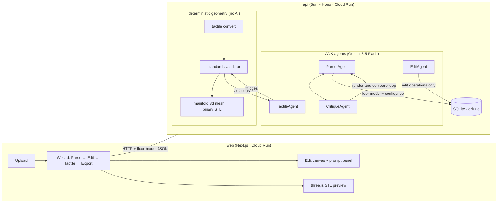

# bumps — maps you can feel

Upload a floor plan, get a 3D-printable tactile map for blind navigation.

Tactile maps let blind and low-vision people learn a building's layout with their fingertips — but today each one is a slow, expensive custom commission, so almost no building has one. bumps automates the whole pipeline: an agent reads the plan, critiques its own extraction, you fix anything on an editable canvas (by hand or by prompt), and a deterministic geometry engine converts it into a standards-compliant, watertight STL with braille labels — ready for any consumer 3D printer.

Built for the All Things Agentic Hackathon (Taskmaster track). Product brief: [docs/idea.md](docs/idea.md) · Requirements: [docs/requirements.md](docs/requirements.md) · Build plan: [docs/phases/](docs/phases/README.md)

## Architecture



Two loops give the system its reliability: the **parse loop** (ParserAgent ↔ CritiqueAgent compare the plan image against a rendering of the extraction until confidence converges) and the **layout loop** (TactileAgent nudges braille/symbols until the deterministic validator measures **zero violations** — the export gate). AI proposes; geometry code disposes: agents can only emit schema-constrained JSON and typed edit operations, never geometry, and only zero-violation designs can become STLs.

Standards enforced in code: BANA Guidelines and Standards for Tactile Graphics (2022) and ADA §703 braille geometry — 200×200 mm plate, 1.0 mm wall lines, 1.5 mm symbols, 0.7 mm spherical-cap braille domes at exact ADA dot pitch, 3 mm fingertip clearance, and a legibility gate that refuses floors too large to print readably.

## Run locally

Requirements: [Bun](https://bun.sh) ≥ 1.3.

```bash
bun install
cd apps/api && bun run db:migrate && cd ../..
echo 'GEMINI_API_KEY=your-key' > apps/api/.env       # aistudio.google.com
cp apps/web/.env.example apps/web/.env.local          # defaults work locally
bun run dev
```

- Web: http://localhost:3000 · API: http://localhost:3003
- Checks: `bun run typecheck` · package tests: `cd packages/floor-model && bun test`

## Deploy

Both services ship as containers to Cloud Run — see [docs/deploy.md](docs/deploy.md) for the exact commands.

## Repo layout

- `apps/web` — Next.js UI: landing, wizard, edit canvas, prompt panel, STL preview
- `apps/api` — Bun + Hono: uploads, ADK agents, validator + mesh generation, SQLite
- `packages/floor-model` — the shared contract: schemas, edit operations, braille, tactile conversion, standards validator (tested)
