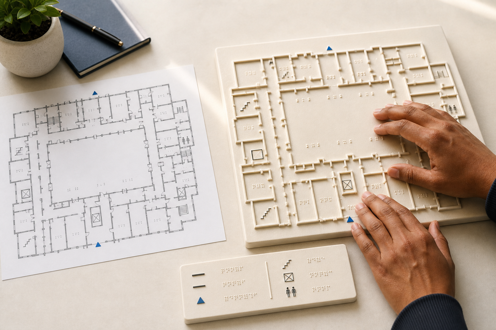
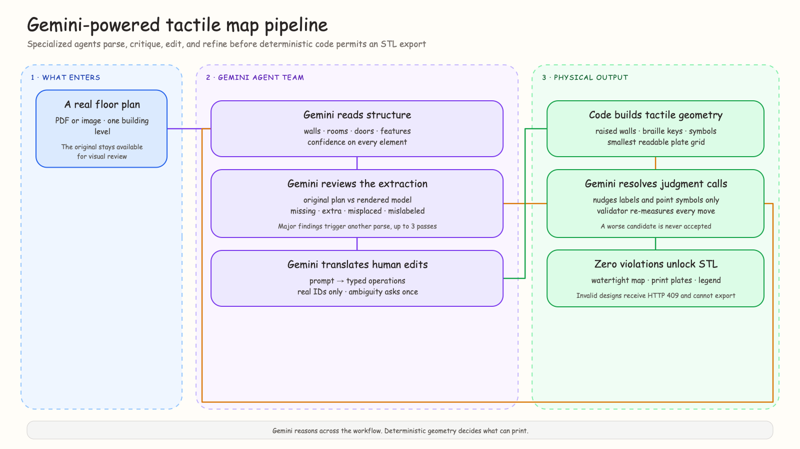
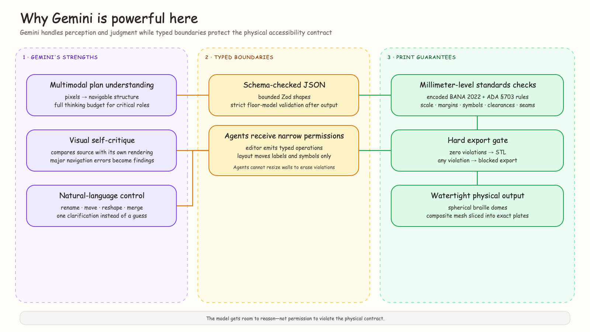
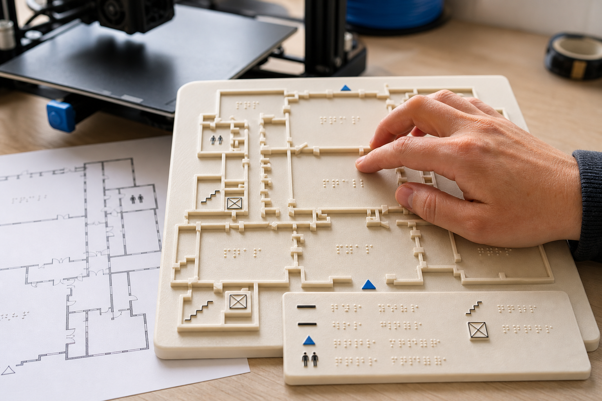

# Building bumps: From Floor Plans to 3D-Printable Tactile Maps with Gemini

_How an agentic review pipeline, deterministic accessibility validator, and constrained geometry system turn visual building plans into maps blind users can feel._

I created this article for the purposes of entering the All Things Agentic Hackathon.



**bumps is a web application that converts an ordinary floor plan into a standards-validated, 3D-printable tactile map for blind and low-vision users.** A user uploads a PDF or image, reviews the extracted structure on an editable canvas, converts it into tactile geometry, and downloads a watertight STL with braille keys and a matching legend plate.

The product is intended to compress a specialist workflow that can take weeks into a guided process that takes minutes. It does not ask a language model to generate a plausible-looking mesh. It builds a typed representation of the building, exposes uncertainty for human review, and refuses export when deterministic measurements fail.

## What bumps actually does

The user journey has four stages:

1. **Parse:** Gemini reads a top-down architectural plan and extracts walls, rooms, doors, windows, entrances, stairs, elevators, restrooms, ramps, printed labels, paths, and roads into versioned vector JSON.
2. **Edit:** the user inspects confidence flags, moves or relabels elements directly, or gives a natural-language instruction that becomes a bounded edit operation.
3. **Tactile:** deterministic code simplifies visual detail, applies the tactile symbol vocabulary, generates braille keys and a legend, selects an appropriate plate grid, and measures every result in millimetres.
4. **Export:** only a zero-violation design is extruded, checked for watertightness, previewed in Three.js, and written as one or more binary STL files.

That end-to-end flow is the reason I built bumps as an agentic system rather than a collection of disconnected AI features. Each stage produces evidence and constraints for the next stage. The agents do not merely answer prompts; they advance a persistent physical-design workflow under explicit gates.

The hardest part of building **bumps** was not generating an STL.

The hard part was taking an architectural drawing made for sighted readers and extracting a model accurate enough to become physical information beneath someone’s fingertips.

A missed wall is not a cosmetic defect. A missed doorway can change how a blind reader understands a route. A hallucinated entrance can be actively misleading. The system needed more than OCR, more than image segmentation, and much more than a single “analyze this floor plan” prompt.

It needed a model that could reason across images, geometry, language, and reviewer feedback without losing the larger task.

That model is **Gemini 3.7 Flash**.

I use Gemini across a team of specialized agents built with Google’s Agent Development Kit for TypeScript. Gemini parses the original plan, critiques its own extraction, converts natural-language corrections into typed operations, and resolves tactile-layout problems under a deterministic validator.

The result is a pipeline that can turn a PDF or floor-plan image into a watertight, 3D-printable tactile map with braille in minutes instead of weeks.

## What makes the workflow agentic

I use “agentic” here in a narrow engineering sense. The system accepts a goal, decomposes it across specialized roles, preserves state between calls, invokes deterministic tools, critiques intermediate work, and continues until a measurable exit condition is satisfied or the user must intervene.

The Parser Agent does not hand its first answer directly to the editor. Its output is normalized, rendered, structurally audited, and reviewed by a separate Critique Agent. The Tactile Layout Agent does not declare success after proposing a visually convincing arrangement. Its moves are applied to the real design and checked again by the same deterministic validator that guards export.

This distinction matters because a linear prompt chain can produce several outputs without taking responsibility for the state transitions between them. bumps makes those transitions explicit: schema validation, confidence gates, critique findings, typed edits, measured violations, and an HTTP 409 export failure when the physical contract is not satisfied.

## Why Gemini fits this problem unusually well

Floor plans combine several kinds of information at once:

- geometric structure expressed through lines and polygons;
- semantic information expressed through labels and symbols;
- architectural conventions such as door arcs and stair markings;
- spatial relationships that only make sense in the context of the whole image; and
- ambiguity that must be surfaced instead of guessed away.

Gemini handles that mixture in one context. I can give it the original image, exact pixel dimensions, a strict output contract, and detailed extraction rules. It returns rooms, wall segments, openings, features, paths, roads, furniture blocks, labels, and a confidence value for each element.

That is already useful, but the feature that made the system genuinely agentic was Gemini’s ability to review visual work—not just produce it.

I render the extracted vector model back into an image and send Gemini two views:

1. the original floor plan; and
2. the system’s rendering of what it believes the plan contains.

Gemini then acts as a visual critic. It reports missing, extra, misplaced, and mislabeled elements. It knows that a sealed room probably means a missed doorway, that flattening a curved wall can change navigable geometry, and that a missing corridor connection is more important than a small furniture offset.

That second-look capability is the center of the product. Gemini is not merely reading pixels. It is evaluating the consequences of its interpretation.



_The implemented pipeline: Gemini parses, visually critiques, edits, and resolves layout judgment calls before deterministic code unlocks export._

## Four agent roles, one exceptionally capable model

All role-specific model selectors in the hackathon runtime are configured for Gemini 3.7 Flash. I use the same model with different instructions, permissions, context, and thinking budgets.

### 1. Parser Agent

The Parser Agent receives the floor-plan image as multimodal input and returns a structured model. It is responsible for classification as well as extraction: a perspective render or unusable photograph is rejected instead of being forced into fake geometry.

Critical parser calls use a full thinking budget and a low temperature. The output includes per-element confidence rather than one vague score for the entire plan.

Gemini extracts:

- walls as straight segments, including short partitions;
- doors and windows associated with walls;
- room polygons and printed labels;
- stairs, elevators, entrances, exits, restrooms, and ramps;
- grouped furniture blocks;
- paths and roads for site or campus plans; and
- orientation when a north marker exists.

The model’s multimodal reasoning lets one agent cover plan types that would otherwise require a brittle chain of OCR, symbol detection, line detection, and hand-authored heuristics.

### 2. Critique Agent

The Critique Agent receives the source image, the rendered extraction, and the structured JSON with element IDs.

Its job is adversarial: find what the parser got wrong.

It labels each finding as missing, extra, misplaced, or mislabeled and assigns severity based on whether the error could mislead a blind reader. Major findings force another parsing pass. The loop runs until the review passes, confidence reaches the target without major issues, or the five-pass limit is reached.

Conceptually, the loop is simple:

```text
floor plan → Gemini parse → render model → Gemini critique
     ↑                                      │
     └──────── reviewer findings ───────────┘
```

The impressive part is how much context Gemini preserves across that loop. The refinement request includes the original image, the previous complete model, and typed critique findings. Gemini fixes the reported errors while keeping unaffected element IDs stable.

That stability matters because every later edit and validation result refers to those IDs.

### 3. Edit Agent

The Edit Agent turns a request such as “rename this room Reception” into a typed operation against the current model.

It does not return free-form replacement geometry. It can only emit a bounded set of operations: add, move, reshape, delete, relabel, merge, or confirm.

For example:

```json
{
  "op": "relabel",
  "id": "r-12",
  "label": "Reception"
}
```

Gemini must reference an ID that exists in the model. If the instruction could refer to several rooms, the agent asks one clarification instead of guessing.

This role uses a zero thinking budget because it is a fast, constrained translation task. The critical visual agents receive more reasoning time; the interaction agent prioritizes responsiveness. Using one Gemini model with role-specific budgets gave me both depth and speed without introducing a second model family.

### 4. Tactile Layout Agent

After deterministic code converts the reviewed floor model into tactile geometry, a millimeter-level validator returns concrete violations.

The Tactile Layout Agent sees the plate, scaled room polygons, and those measured violations. Gemini proposes the smallest useful movements for braille labels and point symbols.

Its permissions are deliberately narrow. It cannot move walls, resize elements, change relief heights, delete difficult geometry, or “solve” a collision by altering the building. It can only nudge labels and symbols involved in reported violations.

Every proposed move is revalidated. If Gemini’s candidate increases the violation count, the system rejects it. Deterministic mechanical fixes run first, so Gemini spends its reasoning only on spatial judgment that arithmetic could not resolve cleanly.

This loop can run up to four times, and the final state must contain zero violations before export.

## Gemini is powerful because the boundaries are strong

The most useful lesson I learned was that giving an agent fewer permissions can make its intelligence more valuable.

Gemini is excellent at perception, comparison, language, and constrained spatial judgment. It should not be the final authority on physical measurements.

That boundary became the project’s engineering principle:

> **Agents make the decisions. Geometry enforces the rules.**

Gemini performs the work that benefits from reasoning. TypeScript performs the work that must be exact.



_Gemini receives room to reason, while schemas, restricted operations, and a hard export gate protect the physical accessibility contract._

## Structured output without blind trust

Each agent is implemented as a Google ADK `LlmAgent` with a Zod output schema. The runtime extracts the JSON payload, parses it, and validates it again before the result can enter the shared floor-model package.

This matters because a model can produce syntactically valid JSON that is still invalid for the application. A wall needs two valid endpoints. A room needs at least three polygon points. A merge needs exactly two compatible IDs. Confidence must stay between zero and one.

I use a tolerant adapter at the model boundary for harmless output dialects, then a strict application schema after normalization. Invalid output fails loudly rather than becoming partial geometry.

The Edit Agent follows the same pattern. Gemini emits a flat schema that is easy for structured generation, and code converts it into the application’s discriminated union. If one operation is malformed, the request is rejected instead of partially applied.

Gemini provides the flexibility. The schemas provide the contract.

## Standards are code, not prompt text

The tactile transform and validator encode applicable rules from the **Braille Authority of North America’s Guidelines and Standards for Tactile Graphics (2022)** and **ADA Standards for Accessible Design §703**.

The validator measures:

- 3 mm clearance between distinct tactile elements;
- 6 mm clearance between similar symbols;
- minimum 5 mm symbol dimensions;
- braille dot diameter, height, and pitch;
- plate margins and composite-grid boundaries;
- braille placement inside or adjacent to its referenced area;
- door and navigation-feature legibility after scaling; and
- seam clearance so braille cells and point symbols are never split across plates.

Large plans are especially important. A visual interface can shrink a complex building until it fits. A fingertip cannot suddenly resolve smaller features.

bumps tries plate grids from 1 × 1 through 4 × 4 and selects the smallest grid that preserves navigation-critical widths. If even the largest grid cannot remain touch-readable, the scale gate fails loudly.

The export API checks the stored `valid` flag. A design with violations receives an HTTP 409 response and no STL is produced.

That is what “AI proposes, geometry disposes” means in practice: Gemini can suggest a better layout, but it cannot declare itself compliant.

## From validated geometry to a physical object

Once the validator reports zero violations, manifold-3d converts the tactile design into watertight geometry.

The mesh engine creates:

- a 3 mm base plate;
- raised wall lines and area textures at distinct relief heights;
- standardized tactile symbols;
- braille as true spherical-cap domes rather than cylinders;
- an assembled composite for the Three.js preview;
- exact per-plate slices for large maps; and
- one or more braille legend plates.

The binary STL writer serializes the final mesh for download. Multi-plate files are sliced from the same composite solid, so their seams align instead of being generated independently.

Gemini’s work remains visible all the way to this stage. The walls, rooms, labels, and features in the physical model originate in its multimodal interpretation—but only after critique, human review, schema validation, tactile transformation, and measurable standards checks.



_The output is physical information, not a visual mock-up: raised walls, distinct symbols, braille keys, and a separate legend are generated as printable geometry._

## Deployment is part of the proof

The public frontend runs on Next.js. The primary Bun and Hono API uses PostgreSQL through Drizzle, while the hackathon proof deployment runs on Google Cloud Run with private Cloud SQL, Secret Manager, Artifact Registry, Cloud Build, and Vertex AI.

The deployed agent path uses Gemini 3.7 Flash through Vertex AI. This matters because a local prototype that happens to call a hosted model is not the same thing as a reproducible cloud system. The submission includes the public application, the Cloud Run services, the database deployment, the architecture evidence, and repository instructions that let judges trace the request from upload through agent execution and export.

I kept model roles independently configurable but intentionally used one Gemini family across perception, critique, editing, and layout. The separation comes from instructions, schemas, permissions, context, and thinking budgets—not from introducing more services than the product needs.

## Why I chose Gemini instead of stitching together narrow models

I could have assembled separate OCR, floor-plan segmentation, object detection, instruction parsing, and layout models.

That would have created more services, more translations between incompatible outputs, and more places for spatial context to disappear.

Gemini 3.7 Flash gave me one reasoning substrate across the entire workflow:

- images and architectural symbols for parsing;
- two-image comparison for critique;
- structured JSON for interoperability;
- language understanding for editing;
- spatial reasoning for tactile layout; and
- fast enough iteration for agent loops inside an interactive product.

The model is the connective tissue. Google ADK gives each role a clear identity, instruction set, session, and output contract. Deterministic code supplies the physical guarantees.

That combination let me build this as a solo developer without reducing the product to a one-shot demo.

## What surprised me most

The best Gemini output was not always the first answer. It was the improvement produced after the model saw a visual rendering of its own work and received a precise reviewer role.

That changed how I think about agent systems.

The value is not simply that a model can generate an answer. The value is that the same capable model can occupy different roles—creator, critic, editor, and constrained optimizer—and pass structured evidence between them.

Gemini made the workflow feel coherent rather than stitched together. The parser understands the same spatial language as the critic. The editor manipulates the same model the parser produced. The layout agent reasons over violations emitted by exact geometry code.

Each role sees a different slice of the problem, but the intelligence underneath remains consistent.

## What comes next

The most important next step is testing physical prints with blind and visually impaired users. A validator can prove that measurements pass the encoded rules. It cannot replace lived experience.

I also want to extend bumps with contracted braille, additional languages, and outdoor tactile maps for campuses, parks, and public spaces.

The long-term goal remains simple: if an organization has a floor plan and access to a consumer 3D printer, it should be able to produce a useful tactile map without commissioning weeks of expensive specialist work.

Gemini is what made that goal technically believable for me. It collapsed a fragmented computer-vision and language pipeline into a coordinated group of agents that can perceive, critique, correct, and improve—while still respecting a deterministic physical boundary.

That is the kind of agentic AI I want to keep building: not a model that merely produces impressive output, but one that can participate in a system designed to earn trust.

## Why I entered bumps in the All Things Agentic Hackathon

The Taskmaster track asks for agents that take a goal and carry out multi-step work. “Upload a floor plan and produce a printable tactile map” is exactly that kind of goal: it crosses multimodal perception, review, human correction, standards conversion, spatial optimization, and mesh generation.

The hackathon also forced a useful architectural discipline. The most impressive demo would have been easy to optimize for: one plan, one model call, one attractive STL. I chose the harder boundary instead. The system has to show its intermediate model, surface uncertainty, preserve element identities across revisions, expose validator failures, and reject an unsafe export.

That makes the agent work visible, but it also makes the product honest. A blind user should not have to trust that a model probably interpreted the building correctly. The software should show where it is uncertain and prove which physical constraints it actually measured.

---

**bumps was built solo for the #AllThingsAgentic Hackathon using Gemini 3.7 Flash, Google ADK for TypeScript, Next.js, Bun, Hono, Three.js, manifold-3d, PostgreSQL, Vercel, Render, and Google Cloud Run.**

Live demo: [bumps on Google Cloud Run](https://bumps-web-1096378308677.asia-south1.run.app/)

Source code and reproducible testing instructions: [github.com/vimzh/bumps](https://github.com/vimzh/bumps)

#AllThingsAgentic #Gemini #GoogleADK #GoogleCloud #AIAgents #Accessibility #3DPrinting
